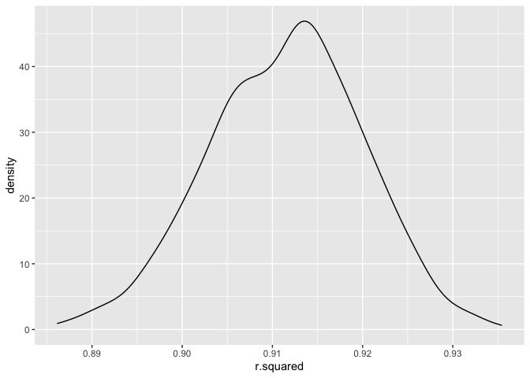
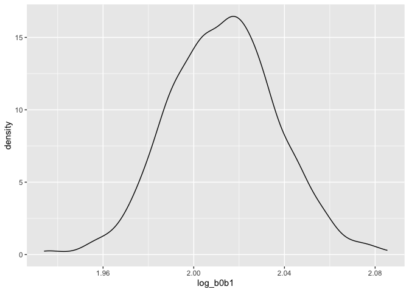
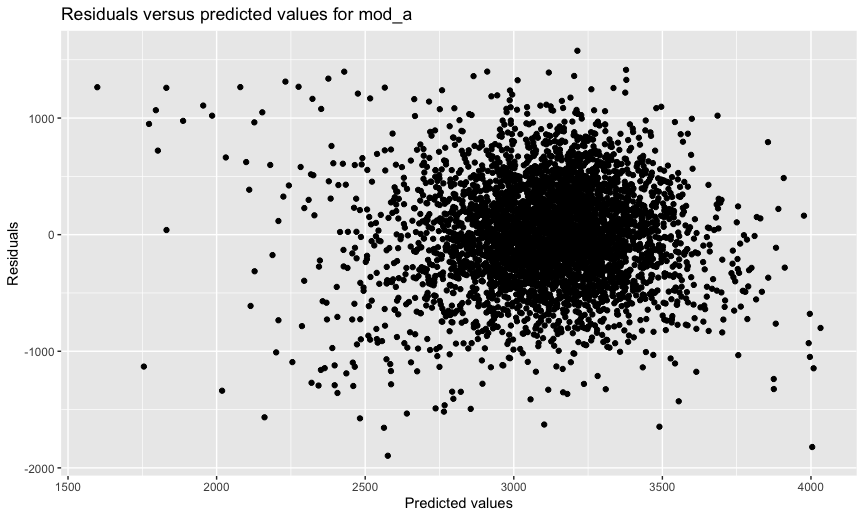
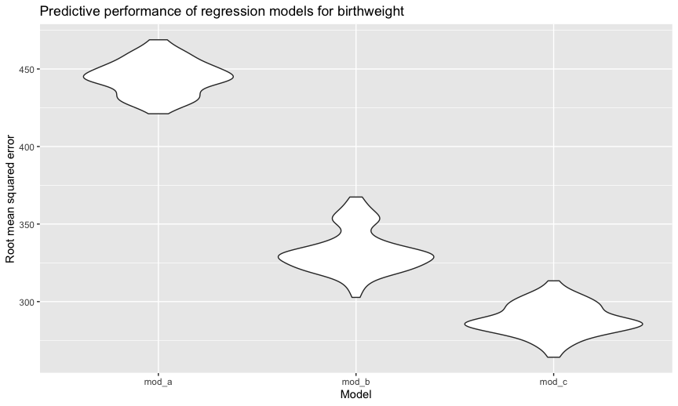

Homework 6
================

## Problem 1

Adapted solution for Problem 1 included below.

``` r
weather_df = rnoaa::meteo_pull_monitors(
    c("USW00094728"),
    var = c("PRCP", "TMIN", "TMAX"), 
    date_min = "2017-01-01",
    date_max = "2017-12-31") %>%
  mutate(name = recode(id, USW00094728 = "CentralPark_NY"),
         tmin = tmin / 10,
         tmax = tmax / 10)
```

    ## Registered S3 method overwritten by 'hoardr':
    ##   method           from
    ##   print.cache_info httr

    ## using cached file: ~/Library/Caches/R/noaa_ghcnd/USW00094728.dly

    ## date created (size, mb): 2022-09-29 10:33:01 (8.401)

    ## file min/max dates: 1869-01-01 / 2022-09-30

``` r
weather_df %>% 
  modelr::bootstrap(n = 1000) %>% 
  mutate(models = map(strap, ~lm(tmax ~ tmin, data = .x)),
         results = map(models, broom::glance)) %>% 
  select(-strap, -models) %>% 
  unnest(results) %>% 
  ggplot(aes(x = r.squared)) + geom_density()
```

<!-- -->

``` r
weather_df %>% 
  modelr::bootstrap(n = 1000) %>% 
  mutate(models = map(strap, ~lm(tmax ~ tmin, data = .x)),
         results = map(models, broom::tidy)) %>% 
  select(-strap, -models) %>% 
  unnest(results) %>% 
  select(id = `.id`, term, estimate) %>% 
  pivot_wider(names_from = term, 
              values_from = estimate) %>% 
  mutate(log_b0b1 = log(`(Intercept)` * tmin)) %>% 
  ggplot(aes(x = log_b0b1)) + geom_density()
```

<!-- -->

## Problem 2

``` r
homicides = read_csv("data/homicide-data.csv") %>%
  mutate(city_state = str_c(city, ", ", state),
         sol_hm = as.numeric(disposition == "Closed by arrest"),
         victim_age = as.numeric(victim_age),
         victim_race = fct_relevel(as.factor(victim_race), "White"),
         victim_sex = fct_relevel(as.factor(victim_sex), "Male")) %>%
  filter(!(city_state %in% c("Dallas, TX", "Phoenix, AZ", "Kansas City, MO", "Tulsa, AL")), 
         victim_race %in% c("Black", "White"),
         victim_sex != "Unknown") %>%
  relocate(city_state, .after = state)
```

``` r
balt_fit_logistic = homicides %>%
  filter(city_state == "Baltimore, MD") %>%
  glm(sol_hm ~ victim_age + victim_race + victim_sex, data = ., family = binomial())

balt_fit_logistic %>% 
  broom::tidy(conf.int = TRUE) %>% 
  mutate(or = exp(estimate),
         conf_low = exp(conf.low),
         conf_high = exp(conf.high)) %>%
  filter(term == "victim_sexFemale") %>%
  select(c(1, 8:10)) %>% 
  knitr::kable(digits = 3)
```

| term             |   or | conf_low | conf_high |
|:-----------------|-----:|---------:|----------:|
| victim_sexFemale | 2.35 |    1.794 |     3.085 |

``` r
cities_log_reg = homicides %>%
  nest(data = -city_state) %>%
  mutate(models = map(data, ~glm(sol_hm ~ victim_age + victim_race + victim_sex, data = ., family = binomial())),
         results = map(models, broom::tidy, conf.int = TRUE)) %>%
  select(-data, -models) %>%
  unnest(results) %>%
  mutate(or = exp(estimate),
         conf_low = exp(conf.low),
         conf_high = exp(conf.high)) %>%
  filter(term == "victim_sexFemale") %>%
  select(c(1:2, 9:11))
```

``` r
cities_log_reg %>% 
  mutate(city_state = fct_reorder(city_state, or)) %>%
  ggplot(aes(x = city_state, y = or, color = city_state)) +
  geom_point() +
  geom_errorbar(aes(ymin = conf_low, ymax = conf_high)) +
  labs(title = "Estimated adjusted odds ratios and confidence intervals for solved homicides, female versus male victims, by city",
       x = "City",
       y = "Estimated odds ratios (with confidence intervals)") +
  theme(legend.position = "none",
        plot.title = element_text(size = 11),
        axis.text.x = element_text(angle = 45, hjust = 1))
```

<!-- -->

## Problem 3

``` r
birthweights = read_csv("data/birthweight.csv") %>%
  mutate(babysex = recode_factor(babysex, "1" = "Male", "2" = "Female"),
         frace = recode_factor(frace, "1" = "White", "2" = "Black", "3" = "Asian", "4" = "Puerto Rican", "8" = "Other"),
         mrace = recode_factor(mrace, "1" = "White", "2" = "Black", "3" = "Asian", "4" = "Puerto Rican", "8" = "Other"),
         malform = recode_factor(malform, "0" = "absent", "1" = "present"),
         fincome = fincome * 100)

birthweights %>%
  skimr::skim()
```

|                                                  |            |
|:-------------------------------------------------|:-----------|
| Name                                             | Piped data |
| Number of rows                                   | 4342       |
| Number of columns                                | 20         |
| \_\_\_\_\_\_\_\_\_\_\_\_\_\_\_\_\_\_\_\_\_\_\_   |            |
| Column type frequency:                           |            |
| factor                                           | 4          |
| numeric                                          | 16         |
| \_\_\_\_\_\_\_\_\_\_\_\_\_\_\_\_\_\_\_\_\_\_\_\_ |            |
| Group variables                                  | None       |

Data summary

**Variable type: factor**

| skim_variable | n_missing | complete_rate | ordered | n_unique | top_counts                              |
|:--------------|----------:|--------------:|:--------|---------:|:----------------------------------------|
| babysex       |         0 |             1 | FALSE   |        2 | Mal: 2230, Fem: 2112                    |
| frace         |         0 |             1 | FALSE   |        5 | Whi: 2123, Bla: 1911, Pue: 248, Asi: 46 |
| malform       |         0 |             1 | FALSE   |        2 | abs: 4327, pre: 15                      |
| mrace         |         0 |             1 | FALSE   |        4 | Whi: 2147, Bla: 1909, Pue: 243, Asi: 43 |

**Variable type: numeric**

| skim_variable | n_missing | complete_rate |    mean |      sd |     p0 |     p25 |     p50 |     p75 |   p100 | hist  |
|:--------------|----------:|--------------:|--------:|--------:|-------:|--------:|--------:|--------:|-------:|:------|
| bhead         |         0 |             1 |   33.65 |    1.62 |  21.00 |   33.00 |   34.00 |   35.00 |   41.0 | ▁▁▆▇▁ |
| blength       |         0 |             1 |   49.75 |    2.72 |  20.00 |   48.00 |   50.00 |   51.00 |   63.0 | ▁▁▁▇▁ |
| bwt           |         0 |             1 | 3114.40 |  512.15 | 595.00 | 2807.00 | 3132.50 | 3459.00 | 4791.0 | ▁▁▇▇▁ |
| delwt         |         0 |             1 |  145.57 |   22.21 |  86.00 |  131.00 |  143.00 |  157.00 |  334.0 | ▅▇▁▁▁ |
| fincome       |         0 |             1 | 4410.53 | 2597.57 |   0.00 | 2500.00 | 3500.00 | 6500.00 | 9600.0 | ▃▇▅▂▃ |
| gaweeks       |         0 |             1 |   39.43 |    3.15 |  17.70 |   38.30 |   39.90 |   41.10 |   51.3 | ▁▁▂▇▁ |
| menarche      |         0 |             1 |   12.51 |    1.48 |   0.00 |   12.00 |   12.00 |   13.00 |   19.0 | ▁▁▂▇▁ |
| mheight       |         0 |             1 |   63.49 |    2.66 |  48.00 |   62.00 |   63.00 |   65.00 |   77.0 | ▁▁▇▂▁ |
| momage        |         0 |             1 |   20.30 |    3.88 |  12.00 |   18.00 |   20.00 |   22.00 |   44.0 | ▅▇▂▁▁ |
| parity        |         0 |             1 |    0.00 |    0.10 |   0.00 |    0.00 |    0.00 |    0.00 |    6.0 | ▇▁▁▁▁ |
| pnumlbw       |         0 |             1 |    0.00 |    0.00 |   0.00 |    0.00 |    0.00 |    0.00 |    0.0 | ▁▁▇▁▁ |
| pnumsga       |         0 |             1 |    0.00 |    0.00 |   0.00 |    0.00 |    0.00 |    0.00 |    0.0 | ▁▁▇▁▁ |
| ppbmi         |         0 |             1 |   21.57 |    3.18 |  13.07 |   19.53 |   21.03 |   22.91 |   46.1 | ▃▇▁▁▁ |
| ppwt          |         0 |             1 |  123.49 |   20.16 |  70.00 |  110.00 |  120.00 |  134.00 |  287.0 | ▅▇▁▁▁ |
| smoken        |         0 |             1 |    4.15 |    7.41 |   0.00 |    0.00 |    0.00 |    5.00 |   60.0 | ▇▁▁▁▁ |
| wtgain        |         0 |             1 |   22.08 |   10.94 | -46.00 |   15.00 |   22.00 |   28.00 |   89.0 | ▁▁▇▁▁ |

``` r
mod_a = lm(bwt ~ delwt + fincome + gaweeks + malform + momage + mrace + smoken, data = birthweights)

mod_a %>%
  broom::tidy() %>%
  knitr::kable(digits = 3)
```

| term              | estimate | std.error | statistic | p.value |
|:------------------|---------:|----------:|----------:|--------:|
| (Intercept)       |  309.683 |    95.904 |     3.229 |   0.001 |
| delwt             |    5.895 |     0.298 |    19.780 |   0.000 |
| fincome           |    0.004 |     0.003 |     1.355 |   0.176 |
| gaweeks           |   54.366 |     2.109 |    25.779 |   0.000 |
| malformpresent    |   -7.685 |   110.466 |    -0.070 |   0.945 |
| momage            |   -1.434 |     1.848 |    -0.776 |   0.438 |
| mraceBlack        | -290.883 |    15.677 |   -18.555 |   0.000 |
| mraceAsian        |  -45.424 |    66.730 |    -0.681 |   0.496 |
| mracePuerto Rican | -139.081 |    29.675 |    -4.687 |   0.000 |
| smoken            |  -11.633 |     0.906 |   -12.841 |   0.000 |

``` r
birthweights %>% 
  add_residuals(mod_a, "resid") %>% 
  add_predictions(mod_a, "fitted") %>% 
  ggplot(aes(x = fitted, y = resid)) + 
  geom_point() +
  labs(title = "Residuals versus predicted values for birthweights regression model",
       x = "Predicted values",
       y = "Residuals")
```

<!-- -->

``` r
cv_df = crossv_mc(birthweights, 100) %>% 
  mutate(train = map(train, as_tibble),
         test = map(test, as_tibble))

cv_df = cv_df %>% 
  mutate(mod_a = map(train, ~lm(bwt ~ delwt + fincome + gaweeks + malform + momage + mrace + smoken, data = .x)),
         mod_b = map(train, ~lm(bwt ~ blength + gaweeks, data = .x)),
         mod_c = map(train, ~lm(bwt ~ bhead + blength + babysex + 
                                      bhead * blength + 
                                      blength * babysex +
                                      bhead * babysex +
                                      bhead * blength * babysex, 
                               data = .x)),
    rmse_mod_a = map2_dbl(mod_a, test, ~rmse(model = .x, data = .y)),
    rmse_mod_b = map2_dbl(mod_b, test, ~rmse(model = .x, data = .y)),
    rmse_mod_c = map2_dbl(mod_c, test, ~rmse(model = .x, data = .y)))
```

``` r
cv_df %>% 
  select(c(7:9)) %>% 
  pivot_longer(everything(), names_to = "model", values_to = "rmse", names_prefix = "rmse_") %>% 
  mutate(model = fct_inorder(model)) %>% 
  ggplot(aes(x = model, y = rmse)) + geom_violin()
```

<!-- -->
